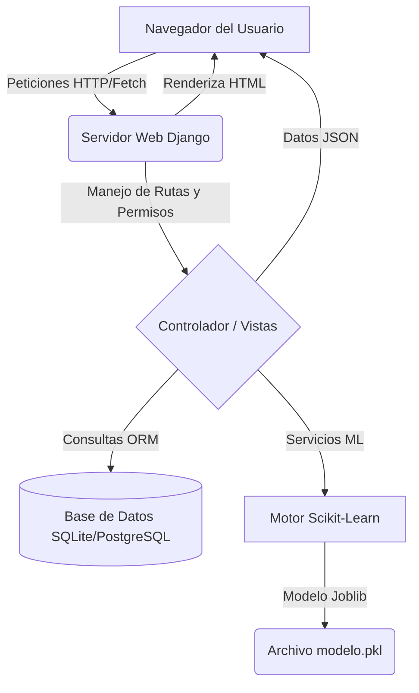
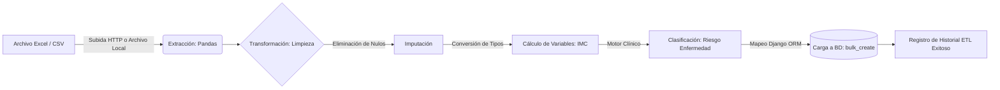
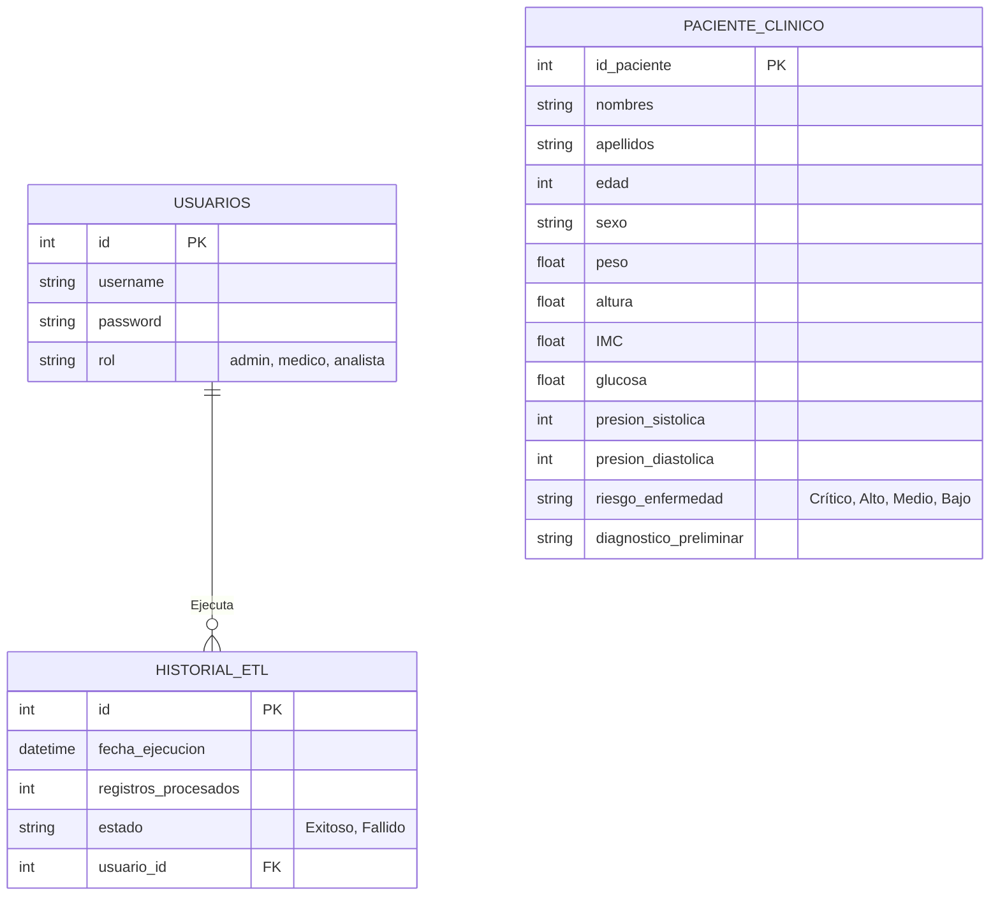

# 5. Diagramas del Sistema

Los siguientes diagramas están codificados en formato Mermaid para que GitHub los renderice nativamente como diagramas visuales en su visor web o en tu editor si cuenta con previsualización.

## 1. Arquitectura del Sistema (Cliente-Servidor)

## 2. Flujo del Proceso ETL

## 3. Modelo Entidad-Relación (Base de Datos)

