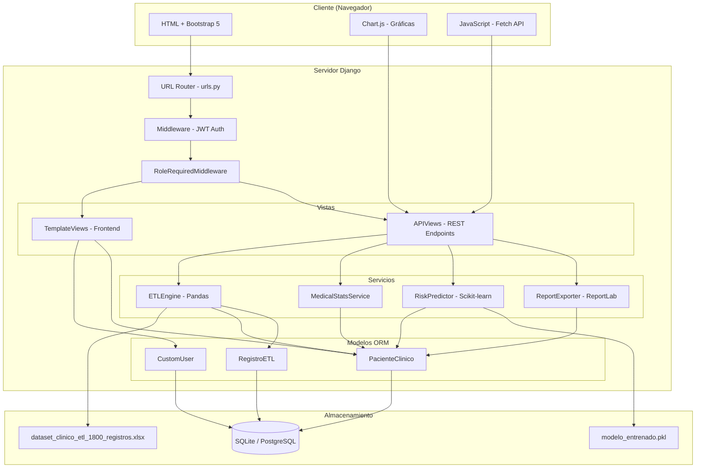
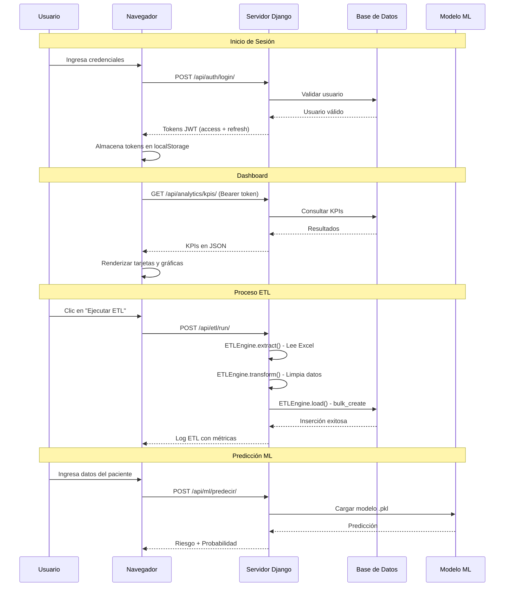
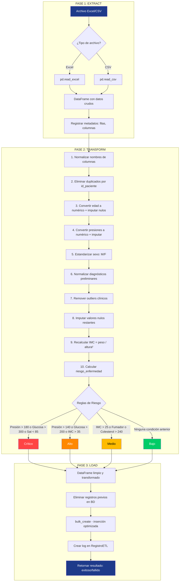
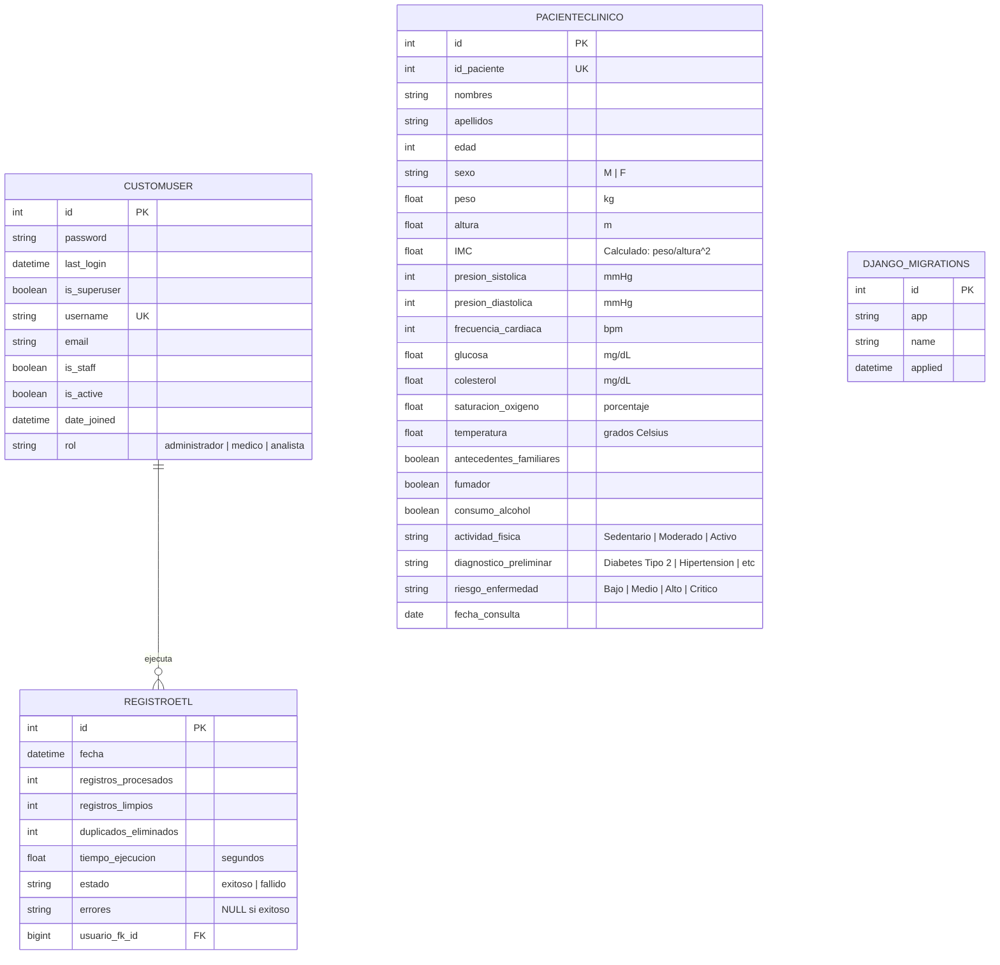
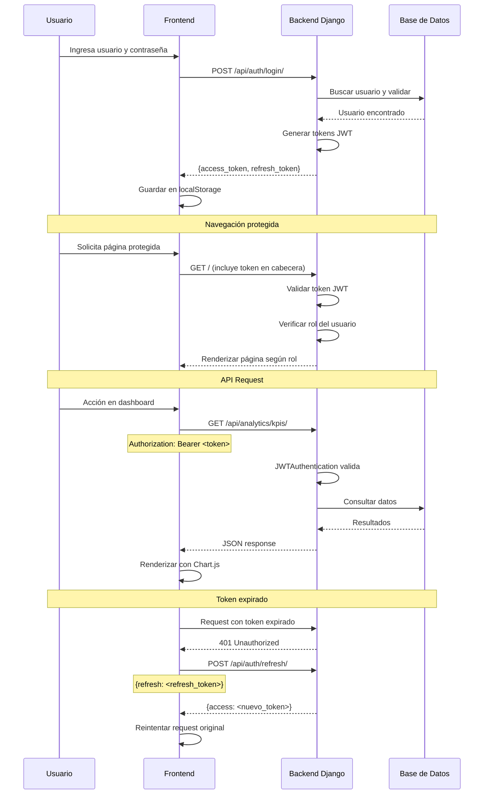
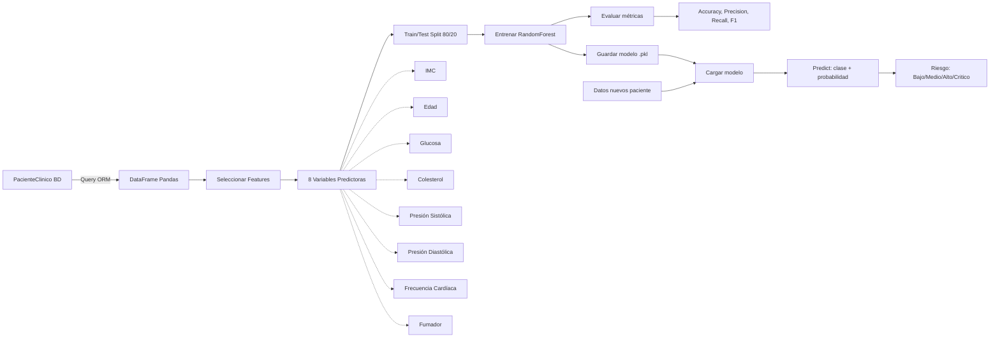

# 5. Diagramas del Sistema

Los siguientes diagramas están codificados en formato Mermaid, compatible con GitHub, GitLab y editores de código modernos.

---

## 1. Arquitectura del Sistema (Despliegue)

---

## 2. Arquitectura Cliente-Servidor (Flujo de Datos)

---

## 3. Flujo del Proceso ETL (Detallado)

---

## 4. Modelo Entidad-Relación (Base de Datos)

---

## 5. Flujo de Autenticación JWT

---

## 6. Pipeline de Machine Learning

